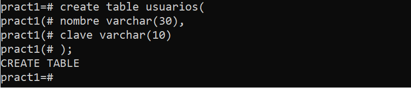

# 1. Introducción
En este informe se muestra y explica el histórico de comandos que se han ejecutado para instalar el **SGDB PostgreSQL** y crear una base de datos de prueba. 

Para ello se ha empleado una máquina virtual soportada por el IaaS, en este caso se denomina ADBD-55.

# 2. Instalación PostgreSQL
En primer lugar, se instala el sistema de gestión de bases de datos **PostgreSQL**, para lo que se accede a la máquina virtual del IaaS y se ejecuta el siguiente comando.

Una vez hecho esto hay que acceder como superusuario.

Tras haber entrado en PostgreSQL para crear la base de datos de prueba es necesario identificarnos con el usuario *postgres*.

Desde aquí ya es posible crear la base de datos de prueba mediante sentencias SQL y ejecutar comandos útiles para obtener información relevante del sistema gestor.

# 3. Base de datos de prueba
 
## 3.1. Creación base de datos

En este momento, si observamos mediante el comando `\l` las bases de datos que se encuentran en el servidor obtenemos lo siguiente.

Para crear una base de datos y que aparezca en la lista anterior debemos ejecutar el comando `CREATE DATABASE nombre`, en este caso la base de datos de prueba se denomina **pract1**.

Como se puede observar la base de datos se ha creado correctamente.

## 3.2. Creación de tablas

Cuando ya se dispone de **pract1**, es necesario crear las tablas que permitan almacenar la información. Para ello, primero hay que conectarse a la base de datos de la siguiente manera.

Ahora procedemos a crear la tabla **usuarios** como se muestra a continuación.

Como se puede ver la tabla está formada por dos columnas llamadas  **nombre** y **clave**, el tipo de dato de las dos es **varchar**. Por tanto, **nombre** contendrá una cadena de 30 caracteres de longitud como máximo, que almacenará el nombre de usuario, por su parte **clave** será otra cadena con un límite de 10 caracteres de longitud, que guardará la clave de cada usuario.    

Por tanto, cada usuario ocupará un registro de esta tabla, con su respectivo nombre y clave.

Para comprobar que la tabla **usuarios** se ha creado correctamente ejecutamos el comando `\dt` que lista las tablas en la base de datos actual.

## 3.3. Introducir datos en una tabla
A continuación,  vamos a introducir 3 usuarios en la tabla como se muestra a continuación.

Ahora para ver el contenido de la tabla con los usuarios que acabamos de añadir se emplea la sentencia SQL `SELECT * FROM usuarios`.

Por último, para salir de la base de datos **pract1** empleamos el comando `\q`, a su vez para salir del sistema gestor PostgreSQL ejecutamos `exit`.

## 4. Conclusión

En conclusión, esta práctica nos ha permitido conocer y empezar a utilizar el sistema gestor de bases de datos PostgreSQL, ya que se ha realizado su instalación y se ha trabajado con una base de datos de prueba. El uso de este sistema será de gran importancia para el resto de la asignatura y nos aportará mayores conocimientos acerca de la administración y diseño de las bases de datos.
